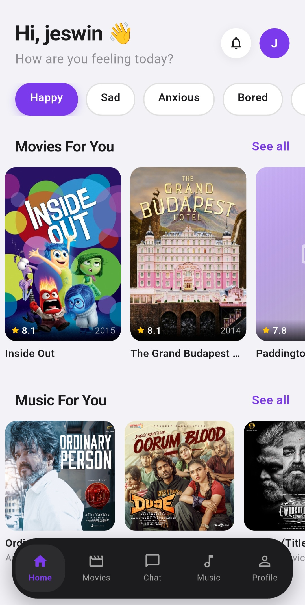
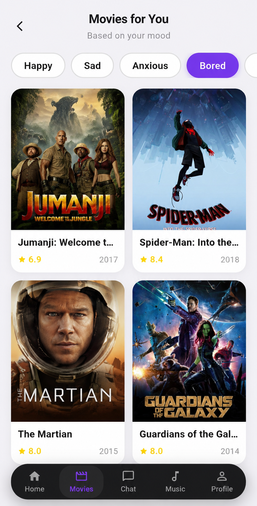
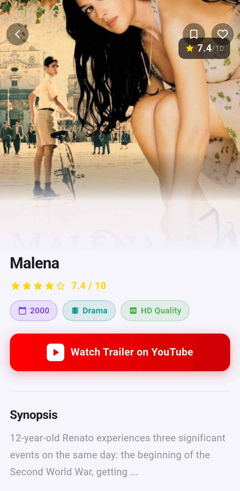
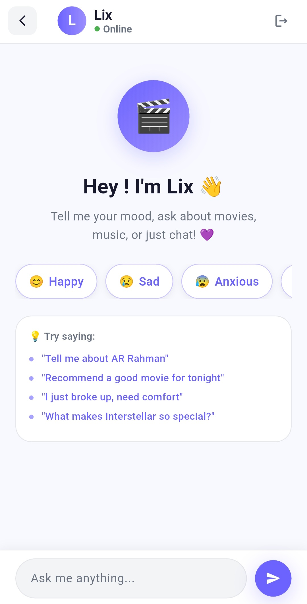
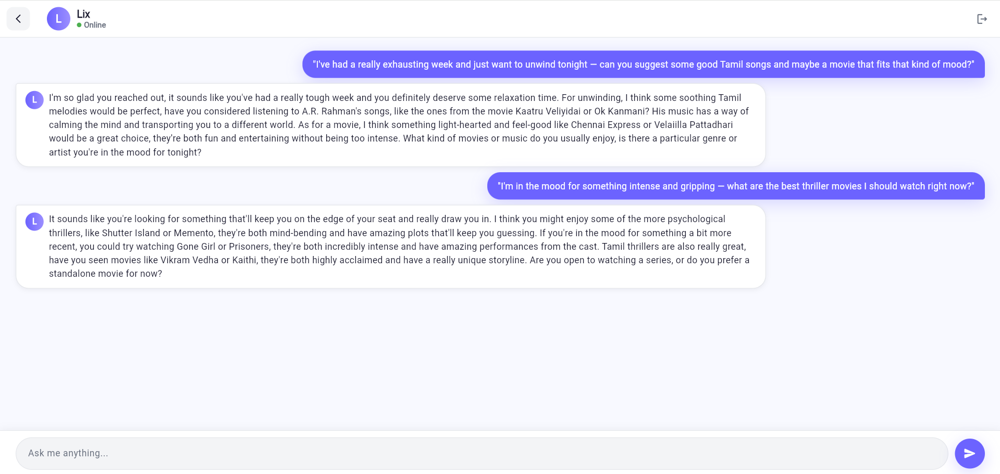
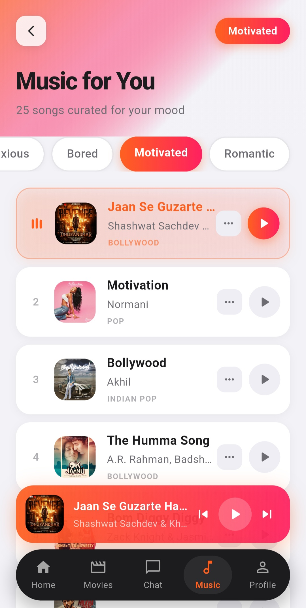
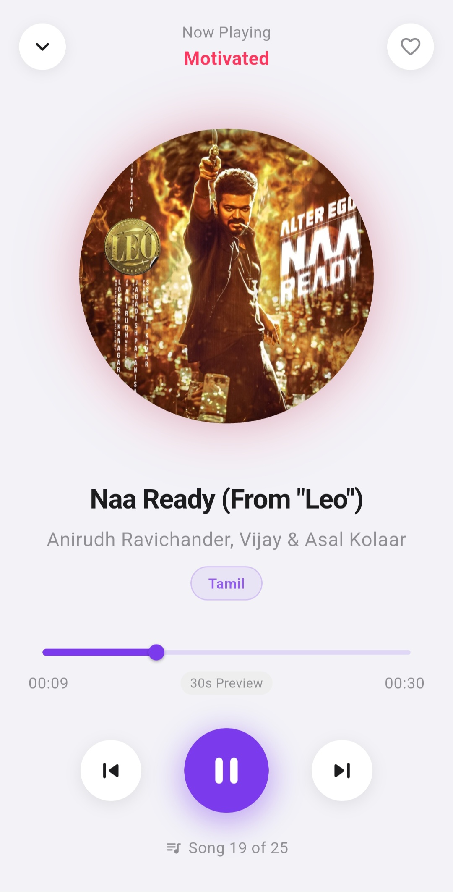

# LIX — Multilingual Entertainment, Personalised for You

<p align="center">
  
</p>

<p align="center">
  <strong>Discover movies and music in your language, matched to your mood.</strong>
</p>

<p align="center">
  
  
  
  
  
</p>

---

## Overview

**LIX** is a multilingual entertainment platform built with Flutter that brings movies and music discovery to users across languages and regions. Whether you are a Tamil speaker in Chennai, an Arabic speaker in Dubai, or an English speaker in London — LIX adapts to your language, your culture, and your current mood.

The app supports **42 languages** including 22 Indian regional languages and 20 global languages, with full **RTL layout support** for Arabic, Urdu, Hebrew, Sindhi, and Kashmiri. At its core, LIX combines personalised mood-based recommendations with a clean, intuitive interface — making entertainment discovery inclusive, personal, and accessible to everyone.

---

## Key Features

### Multilingual Experience
- Full UI switching across **42 languages**
- **22 Indian languages** including Tamil, Hindi, Telugu, Malayalam, Kannada, Bengali, Gujarati, Marathi, Punjabi, and more
- **20 global languages** including English, Arabic, French, Spanish, German, Japanese, Korean, and more
- **RTL layout support** for Arabic, Urdu, Hebrew, Sindhi, and Kashmiri

### Mood-Based Discovery
- Select your current mood — Happy, Sad, Anxious, Bored, Motivated, Romantic — and receive curated movie and music recommendations tailored to how you feel
- Mood filter persists across the Movies and Music sections for a coherent discovery experience

### Movies
- Browse Indian and international movies
- Discover content through mood-based recommendations
- View movie details including rating, year, genre, quality, and synopsis
- Watch trailers directly via YouTube integration
- Save movies to Favourites
- Track watch history

### Music
- Curated playlists based on mood
- Browse songs across Bollywood, Tamil, Pop, Indian Pop, and more
- 30-second song previews with a mini player
- Persistent playback controls across the app
- Full Now Playing page with album art, artist info, and playlist position

### Chat with Lix
- Built-in AI assistant named **Lix**
- Ask for movie recommendations, music suggestions, or just have a conversation
- Context-aware responses that understand mood and preference
- Example prompts supported:
  - *"Recommend a good movie for tonight"*
  - *"Tell me about AR Rahman"*
  - *"I just broke up, need comfort"*
  - *"What makes Interstellar so special?"*

### Profile and Personalisation
- User profile management
- Favourites collection
- Watch history
- Notification support
- Dark mode

### Smart Search
- Search across movies and music
- Language and genre-aware results

---

## Supported Languages

### Indian Languages (22)

| # | Language     | # | Language   | # | Language      |
|---|--------------|---|------------|---|---------------|
| 1 | Hindi        | 9 | Odia       | 17 | Dogri         |
| 2 | Tamil        | 10 | Punjabi    | 18 | Santali       |
| 3 | Telugu       | 11 | Assamese   | 19 | Kashmiri (RTL)|
| 4 | Malayalam    | 12 | Maithili   | 20 | Sindhi (RTL)  |
| 5 | Kannada      | 13 | Sanskrit   | 21 | Manipuri      |
| 6 | Bengali      | 14 | Konkani    | 22 | Bodo          |
| 7 | Gujarati     | 15 | Nepali     |   |               |
| 8 | Marathi      | 16 | Urdu (RTL) |   |               |

### Global Languages (20)

| # | Language      | # | Language    | # | Language     |
|---|---------------|---|-------------|---|--------------|
| 1 | English       | 8 | Russian     | 15 | Turkish      |
| 2 | Arabic (RTL)  | 9 | Japanese    | 16 | Vietnamese   |
| 3 | French        | 10 | Korean     | 17 | Thai         |
| 4 | Spanish       | 11 | Portuguese  | 18 | Hebrew (RTL) |
| 5 | German        | 12 | Italian     | 19 | Indonesian   |
| 6 | Chinese       | 13 | Dutch       | 20 | Swahili      |
| 7 | Malay         | 14 | Polish      |   |              |

> RTL — Right-to-left layout is fully supported for applicable languages.

---

## App Pages

<br/>

---

<br/>

<p align="center">
  
</p>

<br/>

<h3 align="center">Home Page</h3>

<p align="center">
The Home Page is the heart of the LIX experience. The moment a user lands here, the app greets them personally and presents a mood selector that sets the tone for everything that follows. Choosing a mood — whether Happy, Sad, Anxious, Bored, Motivated, or Romantic — instantly reshapes the entire content feed. Movies and music curated for that exact emotional state appear below, making every session feel intentional and personal. This is not a generic content grid. It is a living, responsive dashboard that understands how the user feels and responds accordingly.
</p>

<br/>

---

<br/>

<p align="center">
  
</p>

<br/>

<h3 align="center">Movies Page</h3>

<p align="center">
The Movies Page brings together Indian and international cinema in one unified discovery experience. Films are surfaced based on the user's active mood, removing the burden of searching and replacing it with intelligent curation. Mood filter tabs at the top allow users to switch emotional contexts instantly, with the entire content grid updating in real time. Each film card presents the title, rating, and release year at a glance — clean, minimal, and built for quick decision-making. Whether the user is in the mood for something light-hearted or deeply intense, the right film is always within reach.
</p>

<br/>

---

<br/>

<p align="center">
  
</p>

<br/>

<h3 align="center">Movie Detail Page</h3>

<p align="center">
The Movie Detail Page gives users everything they need to make an informed viewing decision — without leaving the app. The full-screen poster, IMDb rating, release year, genre classification, and quality badge are presented together in a structured, readable layout. A synopsis provides narrative context, and a direct YouTube trailer button lets users preview the film before committing to it. The page also supports saving to Favourites and watchlist management, making it a complete decision and action surface in one place.
</p>

<br/>

---

<br/>

<p align="center">
  
</p>

<br/>

<h3 align="center">Chat Page</h3>

<p align="center">
The Chat Page introduces Lix — the built-in AI assistant and the conversational layer of the LIX platform. Lix is designed to feel like a knowledgeable friend who genuinely understands entertainment. Users can ask for movie recommendations, explore an artist's discography, seek comfort through curated content after a difficult day, or simply have a conversation about something they watched. Quick-tap mood buttons at the top allow users to set an emotional context before typing, and suggested prompts help new users discover what Lix is capable of immediately.
</p>

<br/>

---

<br/>

<p align="center">
  
</p>

<br/>

<h3 align="center">Lix in Conversation</h3>

<p align="center">
This page demonstrates Lix operating at full capacity — understanding nuanced, natural language requests and responding with specific, thoughtful recommendations. When a user describes a difficult week and asks for something to unwind with, Lix does not return a generic list. It considers the emotional context, draws from Indian and international content, and offers curated suggestions with genuine reasoning behind each one. This level of context-awareness sets LIX apart from standard content platforms. The conversation feels human, the recommendations feel considered, and the experience feels built around the individual.
</p>

<br/>

---

<br/>

<p align="center">
  
</p>

<br/>

<h3 align="center">Music Page</h3>

<p align="center">
The Music Page delivers a fully curated listening experience shaped by the user's mood. Rather than presenting an overwhelming library, it surfaces a focused playlist of songs selected for the user's current emotional state — whether that is Motivated, Romantic, Bored, or anything in between. Each track displays the title, artist, and genre tag, with a play button that launches a preview instantly. A persistent mini player at the bottom of the page ensures that music keeps playing seamlessly as the user continues exploring, making the experience feel as fluid as a dedicated music application.
</p>

<br/>

---

<br/>

<p align="center">
  
</p>

<br/>

<h3 align="center">Now Playing Page</h3>

<p align="center">
The Now Playing Page is where the listening experience reaches its fullest expression. The album artwork fills the upper portion of the page with rich visual presence, while the song title, artist name, and language tag are presented cleanly below. A 30-second preview progress bar tracks playback in real time, giving users a clear sense of where they are in the track. Previous, play/pause, and next controls are laid out with generous spacing for effortless one-handed use. The playlist position indicator at the bottom keeps users oriented within the full curated set — a small but considered detail that contributes to a premium feel.
</p>

<br/>

---

## How the App Works

```
1. Launch           →  App loads with language selection
2. Language Pick    →  User selects preferred language (42 options)
3. Home Page        →  Personalised greeting and mood selector
4. Mood Selection   →  Pick a mood: Happy / Sad / Anxious / Bored / Motivated / Romantic
5. Discovery        →  Movies and music curated to that mood appear
6. Explore          →  Browse, search, view details, watch trailers, preview songs
7. Interact         →  Save to Favourites, track History, chat with Lix
8. Profile          →  Manage account, preferences, and settings
```

### Navigation Structure

The app uses a bottom navigation bar with five primary tabs:

| Tab      | Description                                                  |
|----------|--------------------------------------------------------------|
| Home     | Personalised dashboard with mood picker and curated content  |
| Movies   | Full movies section with mood filters and discovery grid     |
| Chat     | Conversational AI assistant (Lix) for recommendations        |
| Music    | Curated playlists and song browsing by mood                  |
| Profile  | User account, favourites, history, and settings              |

---

## Tech Stack

| Layer            | Technology                                              |
|------------------|---------------------------------------------------------|
| Framework        | [Flutter](https://flutter.dev) (Dart)                  |
| State Management | Configured locally (Riverpod / Bloc / Provider)         |
| Localisation     | Flutter Intl / ARB files (42 languages)                 |
| Navigation       | Flutter Navigator 2.0 / GoRouter                        |
| AI Chat          | Claude API (Anthropic)                                  |
| Media Playback   | Flutter audio player                                    |
| Movie Data       | External movie database API                             |
| Storage          | SharedPreferences / Local DB                            |
| Deep Links       | YouTube (trailer integration)                           |

---

## Project Structure

```
lix/
├── lib/
│   ├── main.dart
│   ├── app/
│   │   ├── app.dart
│   │   └── routes.dart
│   ├── core/
│   │   ├── constants/
│   │   ├── theme/
│   │   └── utils/
│   ├── features/
│   │   ├── home/
│   │   ├── movies/
│   │   ├── music/
│   │   ├── chat/
│   │   └── profile/
│   ├── l10n/
│   │   └── *.arb              # 42 language files
│   └── shared/
│       ├── widgets/
│       └── models/
├── assets/
│   ├── images/
│   │   └── logo.png
│   └── screenshots/
├── android/
├── ios/
├── pubspec.yaml
└── README.md
```

---

## Getting Started

### Prerequisites

- Flutter SDK `>=3.0.0`
- Dart SDK `>=3.0.0`
- Android Studio or Xcode (for device or emulator)
- A configured physical device or emulator

### Installation

```bash
# Clone the repository
git clone https://github.com/<your-username>/lix.git

# Navigate into the project
cd lix

# Install dependencies
flutter pub get

# Run the app
flutter run
```

### Build

```bash
# Android APK
flutter build apk --release

# iOS (macOS only)
flutter build ios --release
```

---

## Configuration

> **Important:** This project requires local configuration files for API keys, environment variables, and private settings. These files are intentionally excluded from version control.

Before running the app, create a local configuration file (e.g. `lib/core/constants/env.dart` or `.env`) with your own values:

```dart
// Example — do not commit actual keys
const String apiKey = 'YOUR_API_KEY_HERE';
const String baseUrl = 'YOUR_BASE_URL_HERE';
```

Ensure the following entries are present in your `.gitignore`:

```
*.env
lib/core/constants/secrets.dart
google-services.json
GoogleService-Info.plist
```

Never commit API keys, tokens, or private configuration to version control.

---

## Roadmap

| Status    | Feature                                |
|-----------|----------------------------------------|
| Completed | Mood-based movie recommendations       |
| Completed | Mood-based music playlists             |
| Completed | 42-language localisation               |
| Completed | RTL layout support                     |
| Completed | AI chat assistant (Lix)                |
| Completed | Favourites and watch history           |
| Completed | Dark mode                              |
| Completed | 30-second song preview player          |
| Planned   | Offline mode and content caching       |
| Planned   | User reviews and ratings               |
| Planned   | Social sharing                         |
| Planned   | Push notifications for new releases    |
| Planned   | Watch party and sync feature           |
| Planned   | Advanced search with filters           |

---

## Developer

**Jeswin**
Flutter Developer · Madurai, Tamil Nadu, India

LIX was built with a clear purpose — to make entertainment discovery feel personal, inclusive, and intelligent. In a world where most platforms optimise for the majority, LIX is built for everyone. Every language supported, every mood considered, every user seen.

---

<p align="center">
  Built with Flutter · Made for everyone, in every language
</p>
