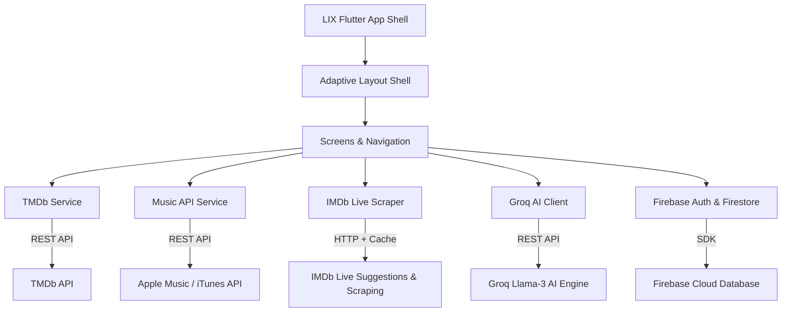

<div align="center">

# LIX

### Next-Generation Multilingual Media & AI Companion
*Apple Senior UI/UX Design System • TMDb, Apple Music & IMDb Live Data Sources*

<br/>

[](https://flutter.dev)
[](https://dart.dev)
[](https://flutter.dev)
[](https://imdb.com)
[](#supported-languages)
[](LICENSE)

<br/>

---

</div>

## Project Overview

**LIX** is a cross-platform entertainment and AI discovery platform built with Flutter. Built adhering to Apple Human Interface Guidelines (HIG) and a custom Light Aurora UI design system, LIX integrates multi-source media data from TMDb, Apple Music, and live IMDb web scraping with intelligent natural language AI capabilities.

The platform offers real-time mood-driven recommendation engines, streaming 30-second audio previews, live IMDb ratings and metadata, cloud synchronized watch and listen history, and localized content delivery across **42 languages** with native Right-to-Left (RTL) layout support.

---

## Key Features

### 1. Multi-Source Media Engine
- **TMDb Integration**: Real-time retrieval of trending movies, genres, release metadata, and poster imagery.
- **Apple Music Integration**: Live song discovery and high-fidelity 30-second audio previews via the Apple Music / iTunes API.
- **IMDb Live Integration**: Asynchronous live scraping of IMDb ratings, top rank standings, title IDs, and direct web links with anti-scraping mitigation and in-memory TTL caching.

### 2. Conversational AI Companion
- **Groq Llama-3 Backend**: Natural conversation and media recommendation hub.
- **Context-Aware Assistance**: Instant prompts for music discovery, movie recommendations, mood analysis, and personalized suggestions.

### 3. Apple Light Aurora UI System
- **Subtle Aurora Palette**: Ambient background layers blending violet, rose, sky blue, and mint tints.
- **Glassmorphic Components**: Translucent white surfaces with crisp borders and subtle micro-shadows.
- **Adaptive Shell**:
  - **Desktop / Tablet (>700px)**: Glass sidebar with active indicator badges.
  - **Mobile (<700px)**: Suspended glass bottom navigation capsule bar.

### 4. Cloud Synchronization & Persistence
- **Firebase Auth & Firestore**: Secure user authentication (Email/Password & Google Sign-In) with cloud synchronization for favorites and history logs.
- **Local Resilience**: In-memory caching and fallback handling ensure continuous functionality even during network drops.

---

## Architecture & Data Flow



---

## Supported Languages

LIX supports **42 total languages**, including 22 Indian regional languages and 20 global languages, complete with **Right-to-Left (RTL)** layout mirroring.

### Indian Regional Languages (22)
| # | Language | # | Language | # | Language |
|---|---|---|---|---|---|
| 1 | Hindi | 9 | Odia | 17 | Dogri |
| 2 | Tamil | 10 | Punjabi | 18 | Santali |
| 3 | Telugu | 11 | Assamese | 19 | Kashmiri (RTL) |
| 4 | Malayalam | 12 | Maithili | 20 | Sindhi (RTL) |
| 5 | Kannada | 13 | Sanskrit | 21 | Manipuri |
| 6 | Bengali | 14 | Konkani | 22 | Bodo |
| 7 | Gujarati | 15 | Nepali | | |
| 8 | Marathi | 16 | Urdu (RTL) | | |

### Global Languages (20)
| # | Language | # | Language | # | Language |
|---|---|---|---|---|---|
| 1 | English | 8 | Russian | 15 | Turkish |
| 2 | Arabic (RTL) | 9 | Japanese | 16 | Vietnamese |
| 3 | French | 10 | Korean | 17 | Thai |
| 4 | Spanish | 11 | Portuguese | 18 | Hebrew (RTL) |
| 5 | German | 12 | Italian | 19 | Indonesian |
| 6 | Chinese | 13 | Dutch | 20 | Swahili |
| 7 | Malay | 14 | Polish | | |

---

## Technology Stack

| Layer | Component | Details |
|---|---|---|
| **Framework** | Flutter 3.x | Cross-platform Dart framework targeting Web, Android, iOS, Windows, macOS |
| **Language** | Dart 3.x | Type-safe asynchronous development with sound null safety |
| **Authentication** | Firebase Auth | Email/Password and Google OAuth authentication |
| **Cloud Database** | Cloud Firestore | User preferences, favorite media lists, and watch/listen history |
| **Audio Engine** | AudioPlayers | Native audio preview rendering with position tracking and state controls |
| **External APIs** | TMDb API | Movie metadata, posters, and category discovery |
| | Apple Music API | Music catalog, artwork, and 30-second preview streams |
| | Groq API | Groq Llama-3 LLM conversational endpoint |
| **Scraper** | IMDb Service | Live HTTP search parser with anti-scraping User-Agent headers & TTL cache |

---

## Project Structure

```
lix/
├── assets/
├── lib/
│   ├── main.dart                      # Application Entry Point & AuthGate
│   ├── core/
│   │   ├── app_theme.dart             # Light Aurora Design System & Typography
│   │   └── responsive.dart            # Layout Breakpoints & Centered Wrappers
│   ├── widgets/
│   │   └── adaptive_scaffold.dart     # Desktop Sidebar & Floating Capsule Bar
│   ├── screens/
│   │   ├── home_screen.dart           # Dashboard, Recommendations & Navigation
│   │   ├── chat_screen.dart           # AI Conversational Assistant
│   │   ├── movies_screen.dart         # Movie Catalogue & Mood Filtering
│   │   ├── music_screen.dart          # Music Catalogue & Audio Streamer
│   │   ├── movie_detail_screen.dart   # Detail View with TMDb & IMDb Ratings
│   │   ├── music_player_screen.dart   # Interactive Music Player & Queue
│   │   ├── favourites_screen.dart     # Cloud-Synchronized Saved Media
│   │   ├── history_screen.dart        # Playback & Watch Log Screen
│   │   ├── profile_screen.dart        # User Settings & Account Management
│   │   ├── language_screen.dart       # Multilingual & RTL Language Selection
│   │   └── help_support_screen.dart   # Help & Documentation Surface
│   └── services/
│       ├── tmdb_service.dart          # TMDb REST API Engine
│       ├── music_api_service.dart     # Apple Music / iTunes Search API Engine
│       ├── imdb_service.dart          # IMDb Live Scraper & In-Memory TTL Cache
│       ├── groq_service.dart          # Groq Llama-3 AI Client
│       ├── favourites_service.dart    # Firestore Favorite Sync Service
│       ├── history_service.dart       # Firestore Playback History Logger
│       ├── notifications_service.dart # Notification Management
│       ├── theme_service.dart         # Theme State Controller
│       └── language_service.dart      # 42 Language Manager & Translations
├── pubspec.yaml                       # Dependencies & Assets Configuration
└── README.md                          # Project Documentation
```

---

## Installation & Setup

### Prerequisites
- **Flutter SDK**: Version `3.10.4` or higher
- **Dart SDK**: Version `3.0.0` or higher
- **Browser / IDE**: Google Chrome, VS Code, or Android Studio

### Installation Steps

1. **Clone the Repository**
   ```bash
   git clone https://github.com/jeswinbenedict/lix.git
   cd lix/lix
   ```

2. **Install Dependencies**
   ```bash
   flutter pub get
   ```

3. **Configure Environment File**
   Create a `.env` file in the project root:
   ```env
   GROQ_API_KEY=your_groq_api_key_here
   ```

4. **Run the Application Locally**
   ```bash
   flutter run -d chrome --web-port=8080
   ```

---

## Technical Integration Details

### IMDb Live Data Source (`ImdbService`)
The `ImdbService` operates as an asynchronous secondary data provider:
- **Search Querying**: Executes targeted requests against IMDb search suggestion endpoints (`https://v3.sg.media-imdb.com/suggestion/...`).
- **Rating Extraction**: Parses live IMDb ratings, top rank standings, and direct title links (`https://www.imdb.com/title/{id}/`).
- **Anti-Scraping Mitigation**: Employs realistic browser User-Agent headers, timeout limits (`8 seconds`), and fallback algorithms.
- **In-Memory TTL Caching**: Caches search results locally for 1 hour (`_cacheTtl`), preventing redundant network requests.

### Data Type Safety & History Engine
- All Firestore document fields undergo explicit type checking (`_parseDateTime`) handling `Timestamp`, `DateTime`, `int`, or ISO string values to prevent casting runtime errors.
- Media items passed to detail screens strip transient timestamp attributes before re-persisting history logs.

---

## Build & Deployment

### Web Build
```bash
flutter build web --release
```
Output files are generated in `build/web/` for static hosting (e.g., Firebase Hosting, Vercel, Netlify).

### Android APK Build
```bash
flutter build apk --release
```
Output APK is generated in `build/app/outputs/flutter-apk/app-release.apk`.

---

## Contribution Guidelines

1. **Fork the Repository**: Create a personal fork on GitHub.
2. **Create a Feature Branch**:
   ```bash
   git checkout -b feature/new-capability
   ```
3. **Commit Changes**: Follow conventional commit conventions.
4. **Code Quality**: Ensure zero warnings or errors via `flutter analyze`.
5. **Submit a Pull Request**: Submit a clear description of modifications and verification steps.

---

## License & Attribution

Distributed under the MIT License. See `LICENSE` for details.

- **Developer**: Jeswin
- **Platform**: LIX Media Platform
